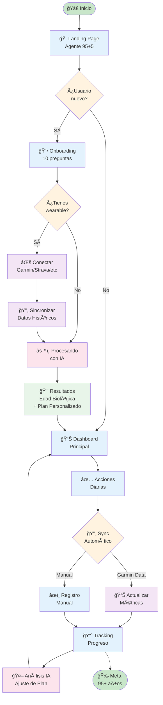

```mermaid
flowchart TD
    Start([🚀 Inicio]) --> Landing[🠠Landing Page<br/>Agente 95+5]
    Landing --> Decision{¿Usuario<br/>nuevo?}
    
    Decision -->|Sí| Onboarding[📋 Onboarding<br/>10 preguntas]
    Decision -->|No| Dashboard[📊 Dashboard<br/>Principal]
    
    Onboarding --> WearableQ{¿Tienes<br/>wearable?}
    WearableQ -->|Sí| ConnectWearable[⌚ Conectar<br/>Garmin/Strava/etc]
    WearableQ -->|No| Processing[âš™ï¸ Procesando<br/>con IA]
    
    ConnectWearable --> SyncData[🔄 Sincronizar<br/>Datos Históricos]
    SyncData --> Processing
    
    Processing --> Results[🯠Resultados<br/>Edad Biológica<br/>+ Plan Personalizado]
    Results --> Dashboard
    
    Dashboard --> Daily[✅ Acciones<br/>Diarias]
    Daily --> AutoSync{🔄 Sync<br/>Automático}
    AutoSync -->|Garmin Data| UpdateMetrics[📊 Actualizar<br/>Métricas]
    AutoSync -->|Manual| ManualInput[âœï¸ Registro<br/>Manual]
    
    UpdateMetrics --> Tracking[📈 Tracking<br/>Progreso]
    ManualInput --> Tracking
    Tracking --> AIAnalysis[🤖 Análisis IA<br/>Ajuste de Plan]
    AIAnalysis --> Dashboard
    
    Tracking -.-> Goal([🉠Meta:<br/>95+ años])
    
    style Start fill:#C8E6C9
    style Landing fill:#E3F2FD
    style Decision fill:#FFF3E0
    style Onboarding fill:#E3F2FD
    style WearableQ fill:#FFF3E0
    style ConnectWearable fill:#F3E5F5
    style SyncData fill:#F3E5F5
    style Processing fill:#FCE4EC
    style Results fill:#E8F5E9
    style Dashboard fill:#E3F2FD
    style Daily fill:#E3F2FD
    style AutoSync fill:#FFF3E0
    style UpdateMetrics fill:#F3E5F5
    style ManualInput fill:#E3F2FD
    style Tracking fill:#E3F2FD
    style AIAnalysis fill:#FCE4EC
    style Goal fill:#C8E6C9
```
