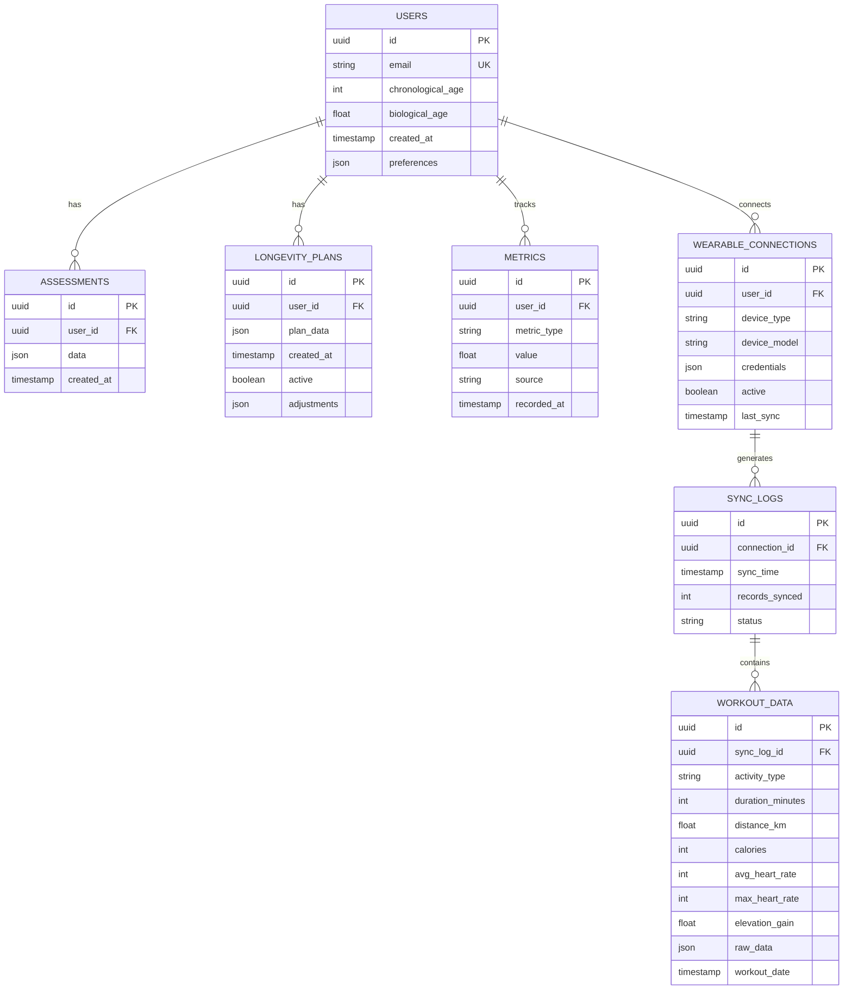

```mermaid
erDiagram
    USERS ||--o{ ASSESSMENTS : has
    USERS ||--o{ LONGEVITY_PLANS : has
    USERS ||--o{ METRICS : tracks
    USERS ||--o{ WEARABLE_CONNECTIONS : connects
    WEARABLE_CONNECTIONS ||--o{ SYNC_LOGS : generates
    SYNC_LOGS ||--o{ WORKOUT_DATA : contains
    
    USERS {
        uuid id PK
        string email UK
        int chronological_age
        float biological_age
        timestamp created_at
        json preferences
    }
    
    ASSESSMENTS {
        uuid id PK
        uuid user_id FK
        json data
        timestamp created_at
    }
    
    LONGEVITY_PLANS {
        uuid id PK
        uuid user_id FK
        json plan_data
        timestamp created_at
        boolean active
        json adjustments
    }
    
    METRICS {
        uuid id PK
        uuid user_id FK
        string metric_type
        float value
        string source
        timestamp recorded_at
    }
    
    WEARABLE_CONNECTIONS {
        uuid id PK
        uuid user_id FK
        string device_type
        string device_model
        json credentials
        boolean active
        timestamp last_sync
    }
    
    SYNC_LOGS {
        uuid id PK
        uuid connection_id FK
        timestamp sync_time
        int records_synced
        string status
    }
    
    WORKOUT_DATA {
        uuid id PK
        uuid sync_log_id FK
        string activity_type
        int duration_minutes
        float distance_km
        int calories
        int avg_heart_rate
        int max_heart_rate
        float elevation_gain
        json raw_data
        timestamp workout_date
    }
```
