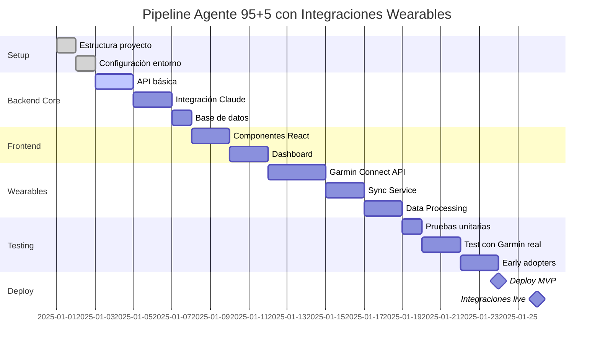

```mermaid
gantt
    title Pipeline Agente 95+5 con Integraciones Wearables
    dateFormat YYYY-MM-DD
    
    section Setup
    Estructura proyecto    :done, 2025-01-01, 1d
    Configuración entorno  :done, 2025-01-02, 1d
    
    section Backend Core
    API básica            :active, 2025-01-03, 2d
    Integración Claude    :2025-01-05, 2d
    Base de datos         :2025-01-07, 1d
    
    section Frontend
    Componentes React     :2025-01-08, 2d
    Dashboard             :2025-01-10, 2d
    
    section Wearables
    Garmin Connect API    :2025-01-12, 3d
    Sync Service          :2025-01-15, 2d
    Data Processing       :2025-01-17, 2d
    
    section Testing
    Pruebas unitarias     :2025-01-19, 1d
    Test con Garmin real  :2025-01-20, 2d
    Early adopters        :2025-01-22, 2d
    
    section Deploy
    Deploy MVP            :milestone, 2025-01-24, 0d
    Integraciones live    :milestone, 2025-01-26, 0d
```
