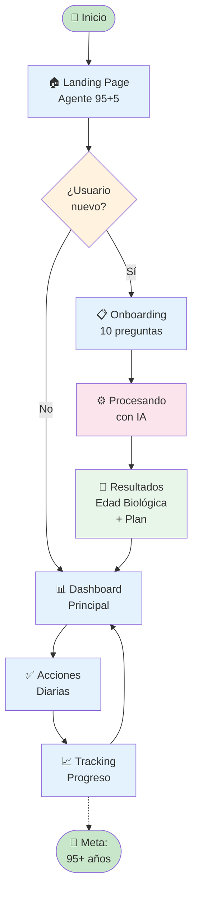

```mermaid
flowchart TD
    Start([🚀 Inicio]) --> Landing[🏠 Landing Page<br/>Agente 95+5]
    Landing --> Decision{¿Usuario<br/>nuevo?}
    
    Decision -->|Sí| Onboarding[📋 Onboarding<br/>10 preguntas]
    Decision -->|No| Dashboard[📊 Dashboard<br/>Principal]
    
    Onboarding --> Processing[⚙️ Procesando<br/>con IA]
    Processing --> Results[🎯 Resultados<br/>Edad Biológica<br/>+ Plan]
    Results --> Dashboard
    
    Dashboard --> Daily[✅ Acciones<br/>Diarias]
    Daily --> Tracking[📈 Tracking<br/>Progreso]
    Tracking --> Dashboard
    Tracking -.-> Goal([🎉 Meta:<br/>95+ años])
    
    style Start fill:#C8E6C9
    style Landing fill:#E3F2FD
    style Decision fill:#FFF3E0
    style Onboarding fill:#E3F2FD
    style Processing fill:#FCE4EC
    style Results fill:#E8F5E9
    style Dashboard fill:#E3F2FD
    style Daily fill:#E3F2FD
    style Tracking fill:#E3F2FD
    style Goal fill:#C8E6C9
```
