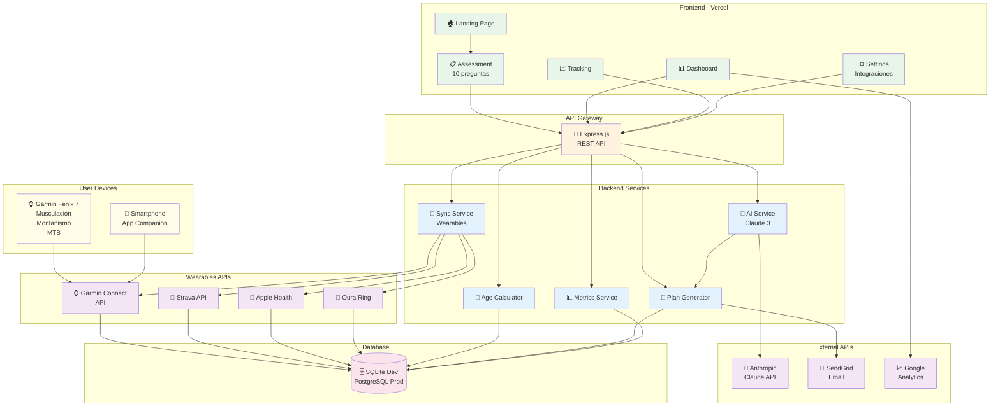

```mermaid
graph TB
    subgraph "Frontend - Vercel"
        A[🏠 Landing Page] 
        B[📋 Assessment<br/>10 preguntas]
        C[📊 Dashboard]
        D[📈 Tracking]
        E[⚙️ Settings<br/>Integraciones]
    end
    
    subgraph "API Gateway"
        F[🔌 Express.js<br/>REST API]
    end
    
    subgraph "Backend Services"
        G[🧮 Age Calculator]
        H[🤖 AI Service<br/>Claude 3]
        I[📝 Plan Generator]
        J[📊 Metrics Service]
        K[🔄 Sync Service<br/>Wearables]
    end
    
    subgraph "Database"
        L[(🗄️ SQLite Dev<br/>PostgreSQL Prod)]
    end
    
    subgraph "Wearables APIs"
        M[⌚ Garmin Connect<br/>API]
        N[🏃 Strava API]
        O[💪 Apple Health]
        P[💍 Oura Ring]
    end
    
    subgraph "External APIs"
        Q[🧠 Anthropic<br/>Claude API]
        R[📧 SendGrid<br/>Email]
        S[📈 Google<br/>Analytics]
    end
    
    subgraph "User Devices"
        T[⌚ Garmin Fenix 7<br/>Musculación<br/>Montañismo<br/>MTB]
        U[📱 Smartphone<br/>App Companion]
    end
    
    T --> M
    U --> M
    
    A --> B
    B --> F
    C --> F
    D --> F
    E --> F
    
    F --> G
    F --> H
    F --> I
    F --> J
    F --> K
    
    K --> M
    K --> N
    K --> O
    K --> P
    
    M --> L
    N --> L
    O --> L
    P --> L
    
    G --> L
    H --> Q
    I --> L
    J --> L
    
    H --> I
    I --> R
    C --> S
    
    style A fill:#E8F5E9
    style B fill:#E8F5E9
    style C fill:#E8F5E9
    style D fill:#E8F5E9
    style E fill:#E8F5E9
    style F fill:#FFF3E0
    style G fill:#E3F2FD
    style H fill:#E3F2FD
    style I fill:#E3F2FD
    style J fill:#E3F2FD
    style K fill:#E3F2FD
    style L fill:#FCE4EC
    style M fill:#F3E5F5
    style N fill:#F3E5F5
    style O fill:#F3E5F5
    style P fill:#F3E5F5
    style Q fill:#F3E5F5
    style R fill:#F3E5F5
    style S fill:#F3E5F5
    style T fill:#FFFDE7
    style U fill:#FFFDE7
```
