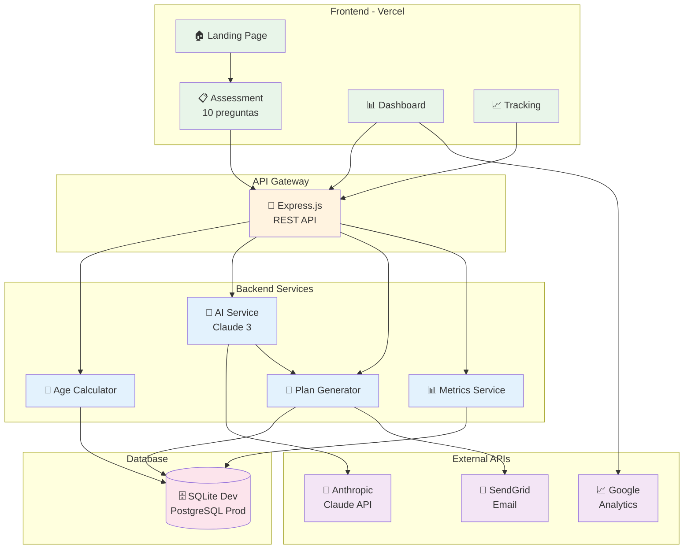

```mermaid
graph TB
    subgraph "Frontend - Vercel"
        A[🏠 Landing Page] 
        B[📋 Assessment<br/>10 preguntas]
        C[📊 Dashboard]
        D[📈 Tracking]
    end
    
    subgraph "API Gateway"
        E[🔌 Express.js<br/>REST API]
    end
    
    subgraph "Backend Services"
        F[🧮 Age Calculator]
        G[🤖 AI Service<br/>Claude 3]
        H[📝 Plan Generator]
        I[📊 Metrics Service]
    end
    
    subgraph "Database"
        J[(🗄️ SQLite Dev<br/>PostgreSQL Prod)]
    end
    
    subgraph "External APIs"
        K[🧠 Anthropic<br/>Claude API]
        L[📧 SendGrid<br/>Email]
        M[📈 Google<br/>Analytics]
    end
    
    A --> B
    B --> E
    C --> E
    D --> E
    
    E --> F
    E --> G
    E --> H
    E --> I
    
    F --> J
    G --> K
    H --> J
    I --> J
    
    G --> H
    H --> L
    C --> M
    
    style A fill:#E8F5E9
    style B fill:#E8F5E9
    style C fill:#E8F5E9
    style D fill:#E8F5E9
    style E fill:#FFF3E0
    style F fill:#E3F2FD
    style G fill:#E3F2FD
    style H fill:#E3F2FD
    style I fill:#E3F2FD
    style J fill:#FCE4EC
    style K fill:#F3E5F5
    style L fill:#F3E5F5
    style M fill:#F3E5F5
```
