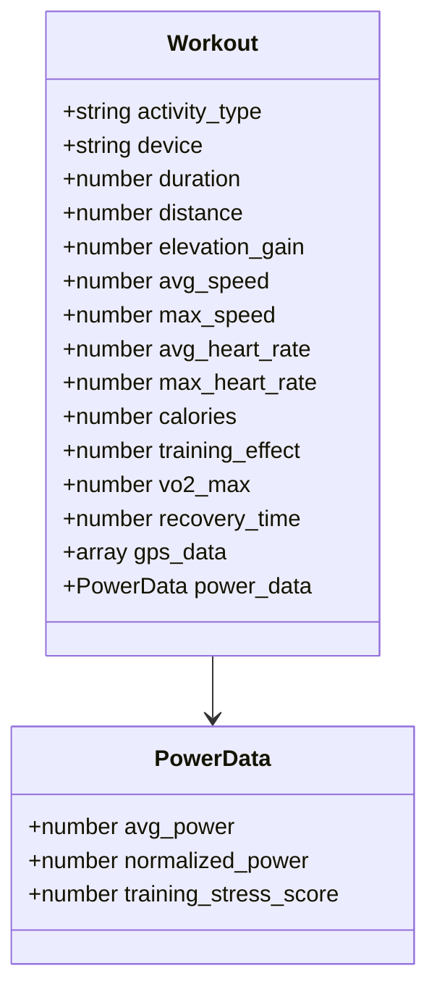

```mermaid
classDiagram
    class Workout {
        +string activity_type
        +string device
        +number duration
        +number distance
        +number elevation_gain
        +number avg_speed
        +number max_speed
        +number avg_heart_rate
        +number max_heart_rate
        +number calories
        +number training_effect
        +number vo2_max
        +number recovery_time
        +array gps_data
        +PowerData power_data
    }

    class PowerData {
        +number avg_power
        +number normalized_power
        +number training_stress_score
    }

    Workout --> PowerData
```
